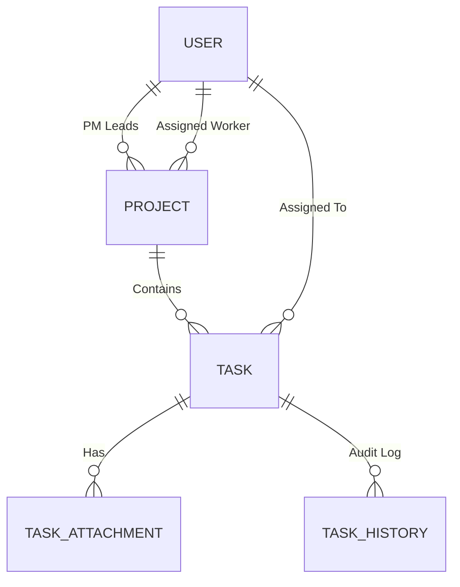
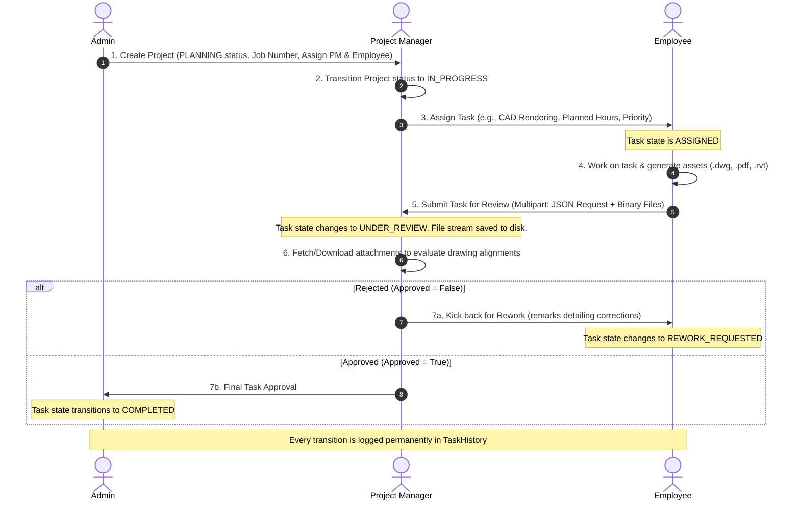

# Architecture Firm Management System: Core Workflows & Performance Models

This document provides a comprehensive blueprint of the system's architecture, data flows, and an implementation plan for the **Employee of the Month** performance measurement system.

---

## 1. Project Entities & Relationships

The application revolves around a hierarchical model designed to manage commercial architectural workflows:



### 🏷️ Core Entities
*   **User (`BaseEntity`)**: Users in the system hold roles like `ADMIN`, `PROJECT_MANAGER` (PM), or `EMPLOYEE`. They are referenced by projects, tasks, and attachments.
*   **Project (`BaseEntity`)**: Represents an architectural contract (e.g., "Om Shanti Commercial Complex") identified by a unique `jobNumber` (e.g., `JOB-2025-1779530922`). It has a start/end date, an assigned Project Lead (PM), and an Assigned Employee.
*   **Task (`BaseEntity`)**: Work assignments within a project. Tasks can be:
    *   *Project-Driven*: Assigned by a PM, linked to a parent project, and initialized in the `ASSIGNED` status.
    *   *Field-Direct*: Self-logged by employees on-site under a spontaneous Verbal Site Order Call (e.g. emergency safety fixes).
*   **TaskAttachment (`BaseEntity`)**: Files uploaded by workers during task submission (CAD plans, Revit models, PDFs). It links files to their parent `Task` and logs upload metadata (`fileName`, `fileType`, `uploadedBy`).
*   **TaskHistory (`BaseEntity`)**: Granular, chronological audit ledger tracking task status changes, the actor who changed them, previous/new status values, and custom remarks.

---

## 2. Dynamic Workflow & Lifecycle Flow

The complete process from contract creation to final approval follows a structured workflow:



### 📁 Technical Breakdown of Task Submission
1.  **Multipart Request Processing**: The submission is accepted via `POST /api/tasks/{taskId}/submit` consuming `multipart/form-data`.
    *   `submission` (Part 1, `application/json`): Contains `submissionNotes` and `hoursInvested`.
    *   `files` (Part 2, Binary list, optional): Stores files locally under `uploads/` securely. Path traversal attempts are neutralized via path sanitization before writing.
2.  **State Upgrades**: The task state upgrades to `UNDER_REVIEW`. The actual effort hours are automatically accumulated onto the task entity.
3.  **Audit Capturing**: A record is appended to `TaskHistory`:
    *   `fromStatus`: `ASSIGNED` (or `REWORK_REQUESTED`)
    *   `toStatus`: `UNDER_REVIEW`
    *   `remarks`: The employee's submission notes.
4.  **Review Processing**: The reviewer responds via `POST /api/tasks/{taskId}/review`:
    *   *If Rejected*: State becomes `REWORK_REQUESTED`. `TaskHistory` gets `UNDER_REVIEW -> REWORK_REQUESTED` with PM's feedback as remarks.
    *   *If Approved*: State becomes `COMPLETED`. `TaskHistory` gets `UNDER_REVIEW -> COMPLETED`.

---

## 3. Employee of the Month (Performance Metric Plan)

> [!NOTE]
> Following the client's decision to deprecate the attendance tracking module, the performance model is engineered strictly around **task delivery metrics** (Task History Audit Ledger) to avoid bias and reward high-quality, high-speed execution.

### 📐 Performance Indicators
1.  **Task Completion Rate ($TCR$)**: The volume of assigned/impromptu tasks successfully driven to a `COMPLETED` status.
2.  **Estimation Accuracy / Time Efficiency ($TE$)**: How close the employee is to the `plannedEffortsHours` when delivering. 
3.  **Initial Output Quality / Defect Rate ($QR$)**: The frequency of tasks kicked back to `REWORK_REQUESTED` via PM reviews. A high rework count represents design errors and high QA overhead.
4.  **Task Priority Weight ($PW$)**: Handling high-pressure, complex issues (`URGENT`, `HIGH` priority) yields higher performance dividends.

---
##Option - 1 FOR EMPLOYEE OF MONTH ----//
### 🧮 Mathematical Scoring Model

For each task $t$ completed by the employee in the current calendar month:

$$\text{Task Score}(t) = \left( \text{Base Points} \times \text{Priority Weight}(t) \times \text{Efficiency Multiplier}(t) \right) - \text{Rework Penalty}(t)$$

#### 1. Constants and Weights
*   **Base Points**: $100$ points per completed task.
*   **Priority Weight ($\text{PW}$)**:
    *   `URGENT`: $1.5$
    *   `HIGH`: $1.3$
    *   `MEDIUM`: $1.0$
    *   `LOW`: $0.8$

#### 2. Efficiency Multiplier ($\text{EM}$)
Calculated by comparing `plannedEffortsHours` ($HP$) and `actualEffortsHours` ($HA$):
*   **Finished Early or On Time ($HA \le HP$)**:
    *   $$\text{EM} = 1.0 + 0.2 \times \left( \frac{HP - HA}{HP} \right)$$
    *   *This yields a maximum $1.2\times$ (20% bonus) score multiplier for ultra-fast delivery.*
*   **Exceeded Plan ($HA > HP$)**:
    *   $$\text{EM} = 1.0 - 0.3 \times \left( \frac{HA - HP}{HP} \right)$$
    *   *This penalizes overruns (30% penalty per percentage of delay), floored at a minimum of $0.1$ to maintain motivation.*

#### 3. Rework Penalty ($\text{RP}$)
Penalizes the worker for low initial drawing quality based on the number of times the task was sent back:
*   $$\text{RP} = 30 \times \text{reworkCount}$$
*   *Each rework cycle deducts 30 points.*

---

### 🏆 Employee of the Month Selection Algorithm

1.  **Scope**: Query all tasks completed within the month:
    ```sql
    SELECT * FROM tasks 
    WHERE status = 'COMPLETED' 
      AND updated_at >= :startOfMonth 
      AND updated_at <= :endOfMonth;
    ```
2.  **Aggregation**: Aggregate scores per worker:
    $$\text{Total Score}_{\text{Employee}} = \sum_{t \in \text{Completed Tasks}} \text{Task Score}(t)$$
3.  **Tie-Breaker**: If two employees have the exact same score:
    *   **Tie-Breaker 1**: The employee who completed more `URGENT` / `HIGH` tasks.
    *   **Tie-Breaker 2**: The employee with the lowest average Rework Defect Rate ($RDR$):
        $$\text{RDR} = \frac{\sum \text{reworkCount}}{\text{Total Tasks Completed}}$$
